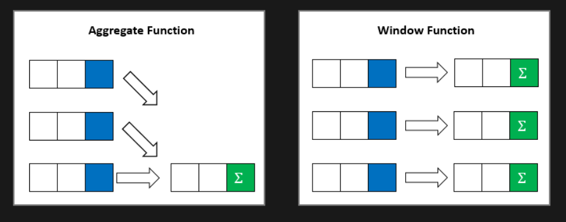
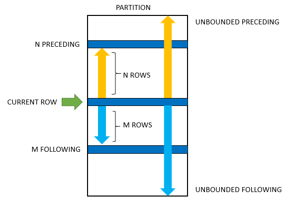

# SQL Window Functions

## Introduction to SQL Window Functions

The aggregate functions (SUM, AVG, COUNT, MIN, MAX, etc) perform calculations across a set of rows and returns a single output row

The following query uses the AVG() aggregate function to calculate the average weight of all patients.

```sql
SELECT 
    AVG(weight) AS avg_weight
FROM
    patients;
```

As shown clearly in the output, all rows from the patients table are grouped into a single row.

Similar to an aggregate function, a window function calculates on a set of rows. However, a window function does not cause rows to become grouped into a single output row.

The following query uses the AVG() as a window function. It returns the avgerage weight of all patients along with the weight of each individual patient:

```sql
SELECT 
    first_name,
    last_name,
    weight,
    AVG(weight) OVER() AS avg_weight
FROM
    patients;
```

In this example, the OVER() clause signals that the AVG() function is used as a window function

The following picture illustrates the main difference between aggregate functions and window functions:



## SQL window function syntax

The syntax of the window functions is as follows:

```sql
window_function_name ( expression ) OVER (
    partition_clause
    order_clause
    frame_clause
)
```

**window_function_name**

The name of the supported window function such as ROW_NUMBER(), RANK(), SUM(), and many more.

**expression**

The target expression or column on which the window function operates.

## OVER clause

The OVER clause defines window partitions to form the groups of rows specifies the orders of rows in a partition. The OVER clause consists of three clauses: partition, order, and frame clauses.

**partition_clause**

The partition clause divides the rows into partitions to which the window function applies. It has the following syntax:

`PARTITION BY expr1, expr2, ...`

If the PARTITION BY clause is not specified, then the whole result set is treated as a single partition.

The order clause specifies the orders of rows in a partition on which the window function operates:

```sql
ORDER BY 
    expression [ASC | DESC]  [NULL {FIRST| LAST}]
    ,...
```

A frame is the subset of the current partition. To define the frame, you use one of the following syntaxes:

```sql
{ RANGE | ROWS } frame_start
{ RANGE | ROWS } BETWEEN frame_start AND frame_end
```

where frame_start is one of the following options:

```sql
N PRECEDING
UNBOUNDED PRECEDING
CURRENT ROW
```

and frame_end is one of the following options:

```sql
CURRENT ROW
UNBOUNDED FOLLOWING
N FOLLOWING
```

The following picture illustrates a frame and its options:



- UNBOUNDED PRECEDING: the frame starts at the first row of the partition.
N PRECEDING: the frame starts at Nth rows before the current row.
CURRENT ROW: means the current row that is being evaluated.
- UNBOUNDED FOLLOWING: the frame ends at the final row in the partition.
N FOLLOWING: the frame ends at the Nh row after the current row.

The ROWS or RANGE specifies the type of relationship between the current row and frame rows.

- ROWS: the offsets of the current row and frame rows are row numbers.
- RANGE: the offset of the current row and frame rows are row values.

## SQL window function types

The window functions are divided into three types value window functions, aggregation window functions, and ranking window functions:

Value window functions

- FIRST_VALUE()
- LAST_VALUE()
- LAG()
- LEAD()

Ranking window functions

- CUME_DIST()
- DENSE_RANK()
- NTILE()
- PERCENT_RANK()
- RANK()
- ROW_NUMBER()

Aggregate window functions

- AVG()
- COUNT()
- MAX()
- MIN()
- SUM()

Filtering By Window Function Result
The value of a window function can not be filtered by a where clause or a having clause by default. To filter by the column you must separate the results as a table using the WITH keyword.

Lets start with a rolling sum of the weight column from the patients table

```sql
SELECT
  patient_id,
  first_name,
  weight,
  SUM(weight) OVER(ORDER BY patient_id) AS rolling_sum
FROM patients
```

Now lets say we want to get all the patients that fall under the 1000 rolling_sum. We can not use the where clause as shown below:

```sql
-- Does not work. 'misuse of aliased window function rolling_sum'
SELECT
  patient_id,
  first_name,
  weight,
  SUM(weight) OVER(ORDER BY patient_id) AS rolling_sum
FROM patients
WHERE rolling_sum < 1000
```

We must use the WITH keyword to separate the results as a temporary table.

```sql
WITH rolling_sum_table AS (
    SELECT
      patient_id,
      first_name,
      weight,
      SUM(weight) OVER(ORDER BY patient_id) AS rolling_sum
    FROM patients
  )
SELECT *
FROM rolling_sum_table
WHERE rolling_sum < 1000;
```