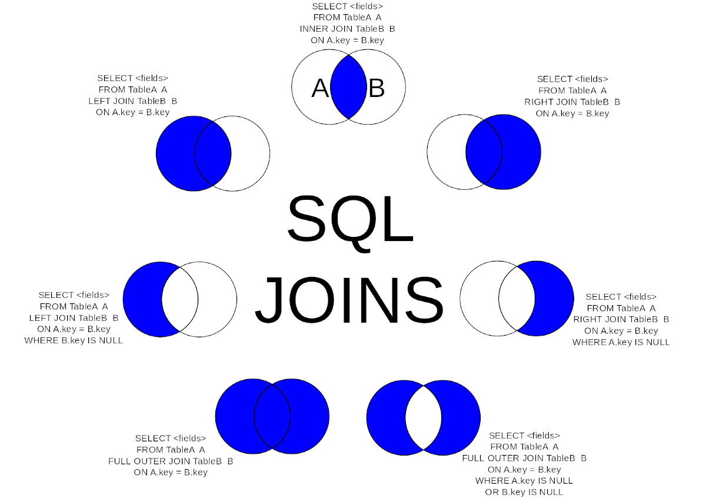

# SQL JOIN

[← README.md](../README.md)

A JOIN clause is used to combine rows from two or more tables, based on a related column (primary, foreign key) between them.

## INNER JOIN Syntax

```sql
SELECT column_name(s)
FROM table1
JOIN table2
ON table1.column_name = table2.column_name;
```

Let's look at a selection from the "unit_dose_orders" (outdated) table:

| unit_dose_order_id | patient_id | dosage  | ... |
| ------------------ | ---------- | ------- | --- |
| 1                  | 9          | 0.25 MG | ... |
| 2                  | 15         | 50 MG   | ... |
| 3                  | 18         | 15      | ... |

Then, look at a selection from the "patients" table:

|patient_id| first_name| last_name| ...|
|-|-|-|-|
|1| Miyuki| Riviera|...|
|2| Deunan| Knute|...|
|3| Lois| McAllister|...|

Notice that the "patient_id" column in the "unit_dose_orders" (outdated) table refers to the "patient_id" in the "patients" table. The relationship between the two tables above is the "patient_id" column.

Then, we can create the following SQL statement (that contains an INNER JOIN), that selects records that have matching values in both tables:

```sql
SELECT *
FROM patients p
JOIN admissions a ON a.patient_id = p.patient_id
```

## Different Types of SQL JOINs
It is rare to need a join other than (INNER) JOIN.

Here are the different types of the JOINs in SQL:

(INNER) JOIN: Returns records that have matching values in both tables

LEFT (OUTER) JOIN: Returns all records from the left table, and the matched records from the right table

RIGHT (OUTER) JOIN: Returns all records from the right table, and the matched records from the left table

FULL (OUTER) JOIN: Returns all records when there is a match in either left or right table



## JOIN Three Tables

```sql
SELECT * 
FROM patients p 
JOIN admissions a ON a.patient_id = p.patient_id
JOIN doctors ph ON ph.doctor_id = a.attending_doctor_id
```

[← README.md](../README.md)